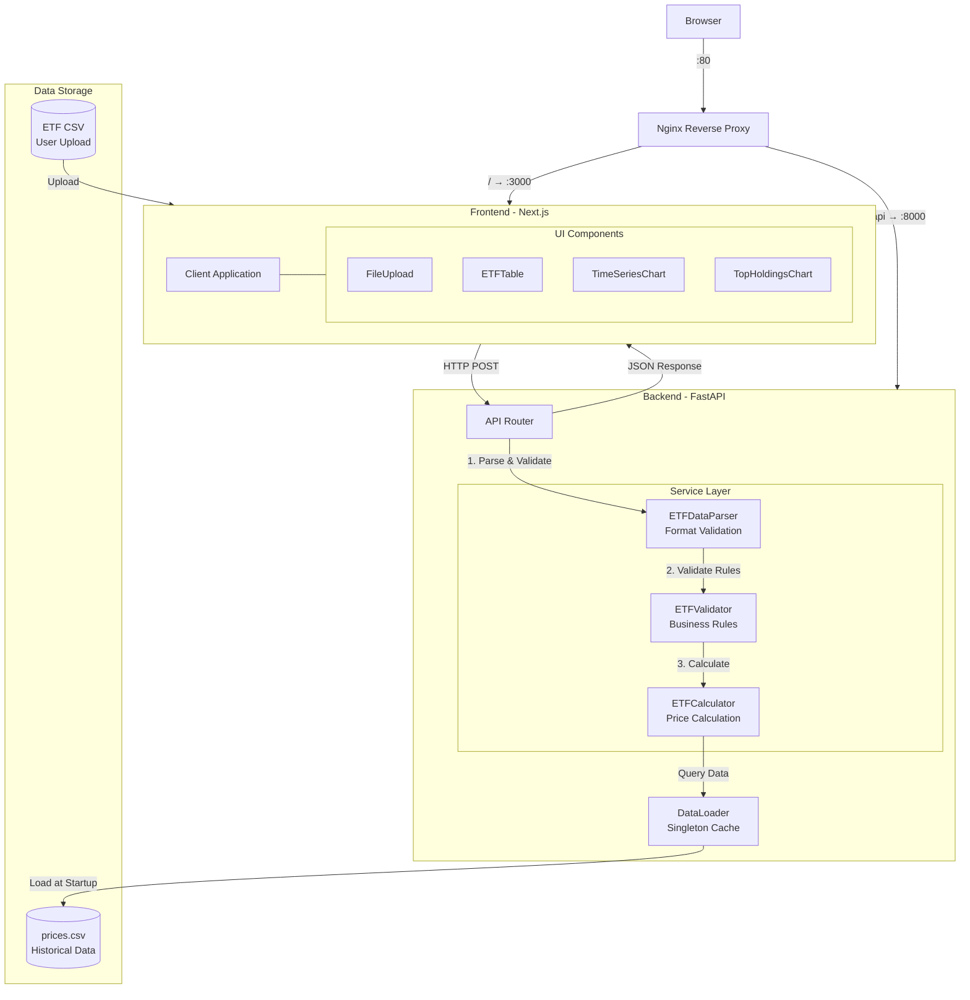

# ETF Price Monitor

A single-page web application for viewing historical ETF prices and analyzing top holdings.

## Features

### Implemented Requirements
- **CSV Upload**: Upload `ETF1.csv` or `ETF2.csv` to configure ETF constituents
- **Interactive Table**: 
  - Displays constituent symbol, weight, and latest price
  - Sortable columns (ascending/descending)
  - Pagination (10 items per page)
- **Time Series Chart**: Zoomable line chart showing reconstructed ETF price history
- **Top 5 Holdings**: Bar chart displaying largest holdings by market value (weight × price)

## Architecture

### Technology Stack

**Frontend**
- **Next.js** (App Router) - React framework with SSR capabilities
- **TypeScript** - Type safety and better developer experience
- **shadcn/ui** - Modern, accessible UI components
- **Recharts** - Declarative charting library for React
- **Tailwind CSS** - Utility-first styling

**Backend**
- **FastAPI** - High-performance Python web framework
- **Pandas** - Data manipulation and analysis
- **Uvicorn** - ASGI server for FastAPI

**Infrastructure**
- **Nginx** - Reverse proxy and load balancer
- **Docker** - Containerization platform
- **Docker Compose** - Multi-container orchestration

### System Architecture



### Project Structure

```
ETF_Price_Monitor/
├── app/                      # Next.js frontend (pages, layout, styles)
│   ├── page.tsx              # Main application page
│   └── lib/                  # TypeScript utilities and types
├── components/               # React UI components
├── api/                      # FastAPI backend
│   ├── index.py              # Main app entry
│   ├── routers/              # API endpoints
│   ├── services/             # Business logic
│   └── tests/                # Test suite (99% coverage)
├── data/                     # Sample CSV files
│   ├── ETF1.csv, ETF2.csv    # Sample ETF configurations
│   └── prices.csv            # Historical price data
├── docker-compose.yml        # Docker orchestration (local build)
├── docker-compose.prod.yml   # Production config (pre-built images)
├── Dockerfile.backend        # Backend container definition
├── Dockerfile.frontend       # Frontend container definition
├── nginx.conf                # Nginx reverse proxy config
├── package.json              # Node.js dependencies
└── requirements.txt          # Python dependencies
```

## Design Decisions

### 1. Frontend Architecture
- **Single Page Application**: All components on one page for better UX
- **Client-Side Rendering**: Charts and tables rendered in browser for interactivity
- **Component-Based**: Modular design with reusable UI components

### 2. Backend Architecture
- **Modular Structure**: Separated routers, services, and data layers
- **Data Caching**: `prices.csv` loaded once at startup (100 rows cached in memory)
- **Dependency Injection**: Services instantiated via FastAPI's DI system

### 3. Data Processing
- **Stateless API**: No session storage; ETF config provided with each request
- **Vectorized Operations**: Pandas used for efficient time-series calculations
- **Error Handling**: Validation for CSV format, missing constituents, and data integrity

### 4. UI/UX Enhancements
- **Responsive Design**: Works on desktop and tablet screens
- **Interactive Elements**: Sortable tables, paginated views, zoomable charts
- **Feedback**: Success/error alerts with auto-dismiss

## Assumptions

The following assumptions were made to complete the challenge within scope. These represent decisions made given limited requirements and serve as discussion points for the technical review.

### 1. Data Quality (About Provided Data)
We assume the provided `prices.csv` data is:
- **Complete**: All dates have price data for all constituents (no missing values)
- **Accurate**: Historical prices are correct and verified
- **Well-formatted**: DATE column uses `YYYY-MM-DD` format consistently
- **Type-safe**: All price values are valid numeric types

### 2. Business Logic
- **Static Weights**: ETF constituent weights remain constant over the entire time period
- **ETF Price Calculation**:
  ```
  ETF_price(t) = Σ (weight_i × constituent_price_i(t))
  ```
  The ETF price at any time is the weighted sum of all constituent prices
- **Holding Value Calculation**:
  ```
  holding_value_i = weight_i × latest_price_i
  ```
  Holding value = weight × latest closing price (not market capitalization)
- **Latest Price Definition**: "Latest price" refers to the most recent date available in `prices.csv`

### 3. Input Validation (What We Verify)
The application validates all uploaded CSV files to ensure data integrity:

**Format Validation:**
- CSV must contain exactly two required columns: `name` and `weight`
- Column names must be unique (no duplicate headers)
- File must not be empty

**Business Rule Validation:**
- Weights must be numeric values in range [0, 1]
- Total weight must sum to 1.0 (±0.5% tolerance for floating-point precision)
- All constituent symbols must exist in the historical price data
- Constituent symbols must be unique (no duplicate holdings)

### 4. Scope & Technical Constraints
- **Single User**: No authentication or multi-user support required
- **Stateless**: No data persistence; all data held in memory during session
- **Development Mode**: Backend (port 8000) and frontend (port 3000) run separately
- **CORS Enabled**: Cross-origin requests allowed for local development
- **Memory Assumption**: Historical data size (~100 rows × 40 constituents) fits comfortably in memory
- **Configuration**: Runtime settings managed via environment variables (`.env` files or system environment)

## Quick Start

### Option 1: Docker with Pre-built Images (Recommended)

**Prerequisites:** Docker and Docker Compose

```bash
# Clone repository
git clone https://github.com/JulianZ-CD/ETF_Price_Monitor
cd ETF_Price_Monitor

# Login GitHub Registry (if not already)
docker login ghcr.io

# Start with production config (uses pre-built images)
docker-compose -f docker-compose.prod.yml up
```

**Access:**
- Frontend: [http://localhost](http://localhost)
- API Docs: [http://localhost/api/py/docs](http://localhost/api/py/docs)

**Stop:** `docker-compose -f docker-compose.prod.yml down`

---

### Option 2: Docker with Local Build

**Prerequisites:** Docker and Docker Compose

```bash
# Clone repository
git clone https://github.com/JulianZ-CD/ETF_Price_Monitor
cd ETF_Price_Monitor

# Build and start (default config)
docker-compose up --build
```

**Access:**
- Frontend: [http://localhost](http://localhost)
- API Docs: [http://localhost/api/py/docs](http://localhost/api/py/docs)

**Stop:** `docker-compose down`

---

### Option 3: Local Development

**Prerequisites:** Node.js 20+, Python 3.10+, and npm

Run without Docker for development with hot reload:

1. **Clone and navigate to the project**
```bash
cd ETF_Price_Monitor
```

2. **Set up Python virtual environment**
```bash
python3 -m venv venv
source venv/bin/activate  # On Windows: venv\Scripts\activate
```

3. **(Optional) Configure environment variables**
```bash
# Copy example file and customize if needed
cp .env.example .env
# Edit .env to change settings (e.g., ETF_WEIGHT_TOLERANCE)
```

4. **Install all dependencies and start development servers**
```bash
npm install
npm run dev
```

5. **Access the application**
- Frontend: [http://localhost:3000](http://localhost:3000)
- API Docs: [http://localhost:8000/api/py/docs](http://localhost:8000/api/py/docs)

**Note:** Local development uses separate ports. Docker deployment uses Nginx on port 80.


## Configuration

The backend supports configuration via environment variables. Create `.env.dev` (development) or `.env.prod` (production):

```bash
# Copy example and customize
cp .env.example .env.dev

# Available settings
ETF_WEIGHT_TOLERANCE=0.005  # Weight sum tolerance (default: 0.5%)
```

**Priority:** `ENV_FILE` env var → `.env.dev` → `.env.prod` → `.env` → defaults

## Testing

### Usage Guide
To explore the application:
1. Start the application (see [Quick Start](#quick-start))
2. Upload a sample ETF file (`data/ETF1.csv` or `data/ETF2.csv`)
3. Explore the visualizations:
   - **Interactive Table**: Sort by any column (symbol, weight, price), navigate with pagination
   - **Time Series Chart**: Zoom and pan to explore ETF price trends (2017-01-01 to 2017-04-10)
   - **Top 5 Holdings**: View largest positions by market value (weight × price)

### Automated Tests
**Backend Test Coverage: 99%** - Comprehensive unit and integration tests covering all backend functionality

```bash
# Run all tests
pytest api/tests/

# Run with coverage report
pytest api/tests/ --cov=api --cov-report=term
```

For detailed testing documentation, see [`api/tests/README.md`](api/tests/README.md)

## Future Enhancements

### Near-term
- **Unit Tests**: Pytest for backend, Jest for frontend
- **Error Recovery**: Graceful handling of partial data
- **Export Functionality**: Download calculated results as CSV

### Long-term
- **Database Integration**: PostgreSQL for data persistence
- **Real-time Updates**: WebSocket for live price streaming
- **Multiple ETF Comparison**: Side-by-side analysis
- **Performance Metrics**: Calculate Sharpe ratio, volatility, etc.
- **Date Range Selection**: Custom time period filtering