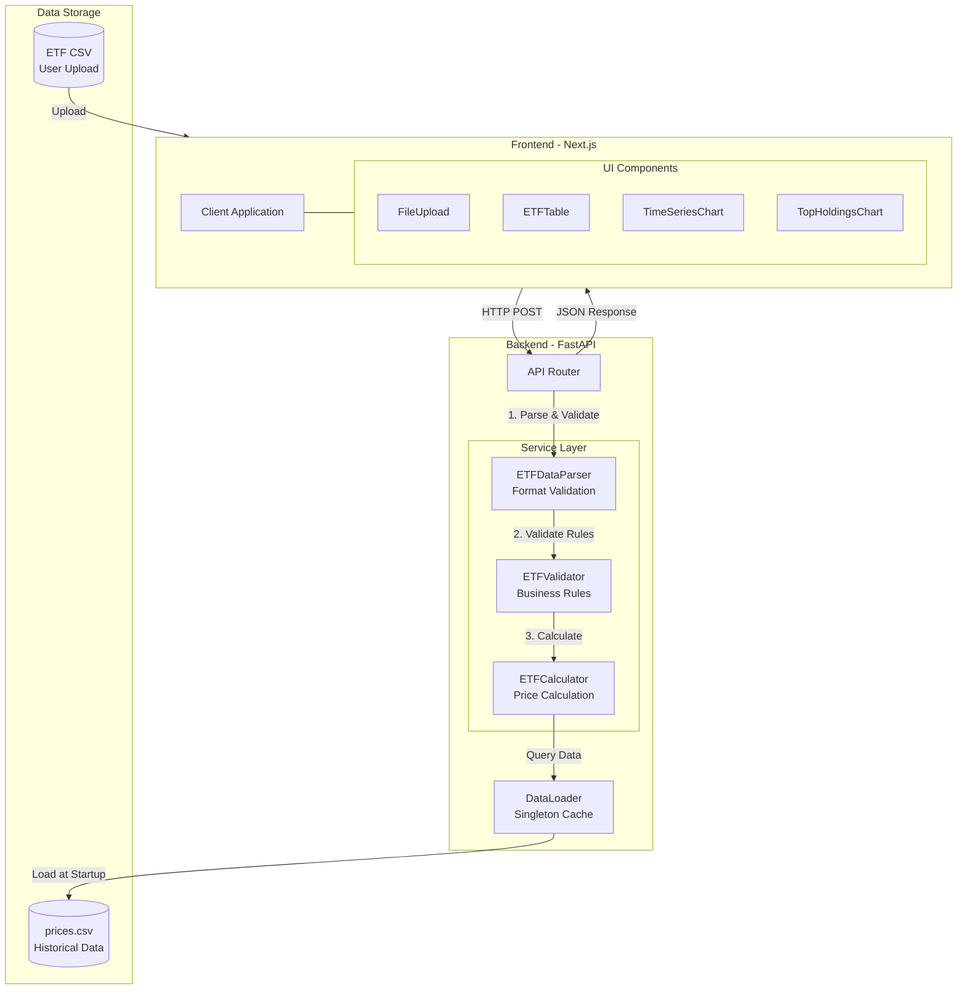

# ETF Price Monitor

A single-page web application for viewing historical ETF prices and analyzing top holdings.

## Quick Start

### Prerequisites
- **Node.js** 18+ and **npm**
- **Python** 3.10+

### Installation & Running

1. **Clone and navigate to the project**
```bash
cd ETF_Price_Monitor
```

2. **Set up Python virtual environment**
```bash
python3 -m venv venv
source venv/bin/activate  # On Windows: venv\Scripts\activate
```

3. **(Optional) Configure environment variables**
```bash
# Copy example file and customize if needed
cp .env.example .env
# Edit .env to change settings (e.g., ETF_WEIGHT_TOLERANCE)
```

4. **Install all dependencies and start development servers**
```bash
npm install
npm run dev
```

This single command will:
- Install Python dependencies from `requirements.txt`
- Install Node.js dependencies
- Start FastAPI backend on port 8000
- Start Next.js frontend on port 3000

5. **Access the application**
- Frontend: [http://localhost:3000](http://localhost:3000)
- Backend API: [http://localhost:8000/api/py/docs](http://localhost:8000/api/py/docs)

---

## Features

### Implemented Requirements
- **CSV Upload**: Upload `ETF1.csv` or `ETF2.csv` to configure ETF constituents
- **Interactive Table**: 
  - Displays constituent symbol, weight, and latest price
  - Sortable columns (ascending/descending)
  - Pagination (10 items per page)
- **Time Series Chart**: Zoomable line chart showing reconstructed ETF price history
- **Top 5 Holdings**: Bar chart displaying largest holdings by market value (weight × price)

---

## Architecture

### Technology Stack

**Frontend**
- **Next.js 16** (App Router) - React framework with SSR capabilities
- **TypeScript** - Type safety and better developer experience
- **shadcn/ui** - Modern, accessible UI components
- **Recharts** - Declarative charting library for React
- **Tailwind CSS** - Utility-first styling

**Backend**
- **FastAPI** - High-performance Python web framework
- **Pandas** - Data manipulation and analysis
- **Uvicorn** - ASGI server for FastAPI

### System Architecture



### ETF Price Calculation
```
ETF_price(t) = Σ (weight_i × constituent_price_i(t))
```

### Holding Value Calculation
```
holding_value_i = weight_i × latest_price_i
```

### Data Processing
- **Forward-fill** missing prices with last known value
- **Backward-fill** any remaining leading NaN values
- Constituents matched by symbol name across datasets

---

## Design Decisions

### 1. Frontend Architecture
- **Single Page Application**: All components on one page for better UX
- **Client-Side Rendering**: Charts and tables rendered in browser for interactivity
- **Component-Based**: Modular design with reusable UI components

### 2. Backend Architecture
- **Modular Structure**: Separated routers, services, and data layers
- **Data Caching**: `prices.csv` loaded once at startup (100 rows cached in memory)
- **Dependency Injection**: Services instantiated via FastAPI's DI system

### 3. Data Processing
- **Stateless API**: No session storage; ETF config provided with each request
- **Vectorized Operations**: Pandas used for efficient time-series calculations
- **Error Handling**: Validation for CSV format, missing constituents, and data integrity

### 4. UI/UX Enhancements
- **Responsive Design**: Works on desktop and tablet screens
- **Interactive Elements**: Sortable tables, paginated views, zoomable charts
- **Feedback**: Success/error alerts with auto-dismiss

---

## Assumptions

### 1. Data Quality (About Provided Data)
We assume the provided `prices.csv` data is:
- **Complete**: All dates have price data for all constituents (no missing values)
- **Accurate**: Historical prices are correct and verified
- **Well-formatted**: DATE column uses `YYYY-MM-DD` format consistently
- **Type-safe**: All price values are valid numeric types

### 2. Business Logic
- **Static Weights**: ETF constituent weights remain constant over the entire time period
- **Holding Value Calculation**: Holding value = weight × latest closing price (not market capitalization)
- **Latest Price Definition**: "Latest price" refers to the most recent date available in `prices.csv`
- **ETF Price Formula**: ETF price = Σ(constituent_price × weight) for all constituents

### 3. Input Validation (What We Verify)
The application validates all uploaded CSV files to ensure data integrity:

**Format Validation:**
- CSV must contain exactly two required columns: `name` and `weight`
- Column names must be unique (no duplicate headers)
- File must not be empty

**Business Rule Validation:**
- Weights must be numeric values in range [0, 1]
- Total weight must sum to 1.0 (±0.5% tolerance for floating-point precision)
- All constituent symbols must exist in the historical price data
- Constituent symbols must be unique (no duplicate holdings)

### 4. Scope & Technical Constraints
- **Single User**: No authentication or multi-user support required
- **Stateless**: No data persistence; all data held in memory during session
- **Development Mode**: Backend (port 8000) and frontend (port 3000) run separately
- **CORS Enabled**: Cross-origin requests allowed for local development
- **Memory Assumption**: Historical data size (~100 rows × 40 constituents) fits comfortably in memory
- **Configuration**: Runtime settings managed via environment variables (`.env` files or system environment)

---

## Configuration

The backend supports configuration via environment variables. Create `.env.dev` (development) or `.env.prod` (production):

```bash
# Copy example and customize
cp .env.example .env.dev

# Available settings
ETF_WEIGHT_TOLERANCE=0.005  # Weight sum tolerance (default: 0.5%)
```

**Priority:** `ENV_FILE` env var → `.env.dev` → `.env.prod` → `.env` → defaults

---

## Project Structure

```
ETF_Price_Monitor/
├── app/                      # Next.js frontend
│   ├── page.tsx              # Main application page
│   ├── layout.tsx            # Root layout with metadata
│   └── globals.css           # Global styles and theme
├── components/               # React components
│   ├── FileUpload.tsx        # CSV upload component
│   ├── ETFTable.tsx          # Interactive data table
│   ├── TimeSeriesChart.tsx   # Zoomable line chart
│   ├── TopHoldingsChart.tsx  # Bar chart for top 5
│   └── ui/                   # shadcn/ui components
├── lib/                      # Utilities and types
│   ├── types.ts              # TypeScript interfaces
│   └── utils.ts              # Helper functions
├── api/                      # FastAPI backend
│   ├── index.py              # Main FastAPI app
│   ├── config.py             # Configuration settings
│   ├── routers/              # API route handlers
│   │   └── etf_router.py     # ETF endpoints
│   ├── services/             # Business logic
│   │   ├── data_loader.py    # Singleton data cache
│   │   ├── calculator.py     # ETF calculations
│   │   └── validator.py      # Data validation
│   ├── utils/                # Utility modules
│   │   └── logger.py         # Logging utilities
│   └── tests/                # Backend test suite
│       ├── unit/             # Unit tests
│       └── integration/      # Integration tests
├── data/                     # Sample data
│   ├── ETF1.csv              # Sample ETF config
│   ├── ETF2.csv              # Sample ETF config
│   └── prices.csv            # Historical prices
├── .env.example              # Environment variables template
└── requirements.txt          # Python dependencies
```

---

## Future Enhancements

### Near-term
- **Unit Tests**: Pytest for backend, Jest for frontend
- **Error Recovery**: Graceful handling of partial data
- **Export Functionality**: Download calculated results as CSV

### Long-term
- **Database Integration**: PostgreSQL for data persistence
- **Real-time Updates**: WebSocket for live price streaming
- **Multiple ETF Comparison**: Side-by-side analysis
- **Performance Metrics**: Calculate Sharpe ratio, volatility, etc.
- **Date Range Selection**: Custom time period filtering
- **Dockerization**: Container-based deployment

---

## Testing

### Manual Testing
To test the application manually:
1. Start the development server with `npm run dev`
2. Navigate to `http://localhost:3000`
3. Upload `data/ETF1.csv` or `data/ETF2.csv`
4. Verify:
   - Table displays all constituents with correct data
   - Time series chart shows ETF price from 2017-01-01 to 2017-04-10
   - Top 5 bar chart displays correct holdings sorted by value
   - All charts and tables are interactive

### Automated Backend Tests
**99% coverage**: covering all backend functionality (unit + integration tests)

```bash
# Run all tests
pytest api/tests/

# Run with coverage report
pytest api/tests/ --cov=api --cov-report=term
```

For detailed testing documentation, see [`api/tests/README.md`](api/tests/README.md)
